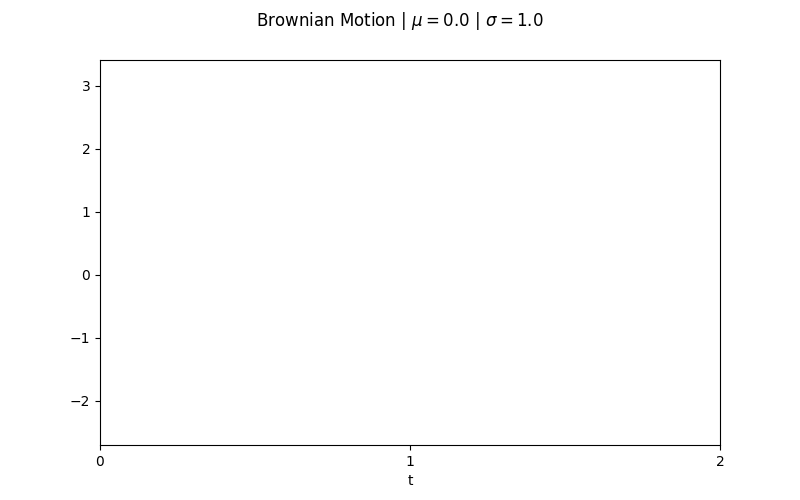
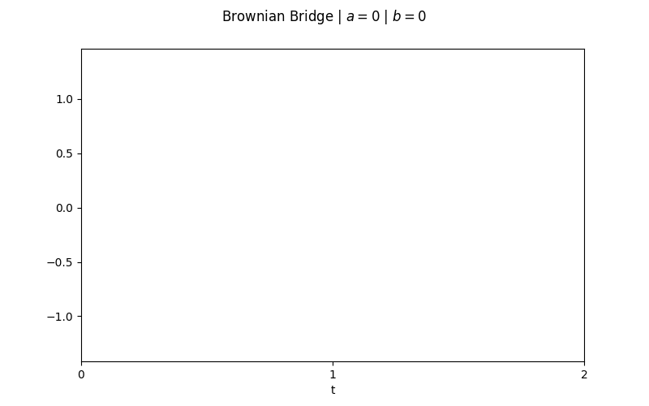
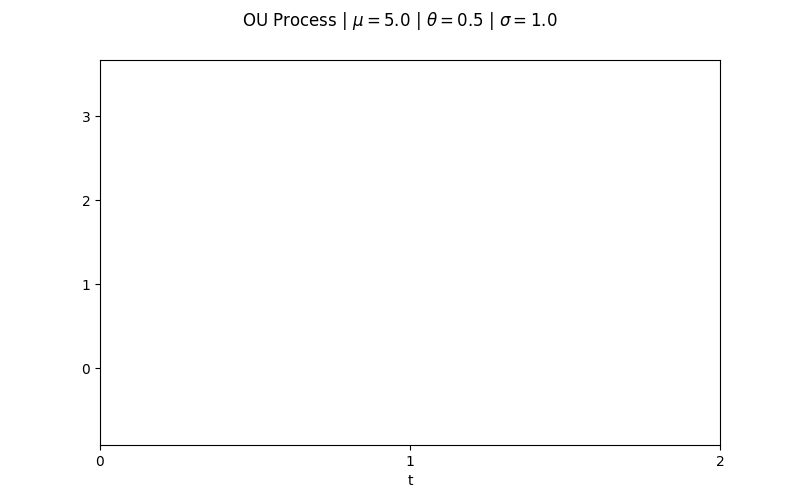

# Random Processes

This repository provides a collection of Python classes for simulating common random (stochastic) processes, including Bernoulli Processes, Random Walks, Brownian Motion, Ornstein-Uhlenbeck Processes, Geometric Brownian Motion, and Brownian Bridges. It currently contains only univariate processes, but each process can be simulated many paths at a time.



All simulations are implemented in the `randomProcesses.py` file, with simple interfaces for simulating and visualizing sample paths. For continuous methods, discretization is configurable by the user. The default is 100 steps per period.

## Features

- **BernoulliProcess**: Simulates independent Bernoulli trials.
- **RandomWalk**: Generates discrete symmetric random walks.
- **BrownianMotion**: Simulates standard Brownian motion (Wiener process).
- **OUProcess**: Simulates the Ornstein-Uhlenbeck process (mean-reverting).
- **GeometricBM**: Simulates geometric Brownian motion (used in finance).
- **BrownianBridge**: Simulates a Brownian bridge between two points.
- (Placeholders for PoissonProcess and MarkovChain.)

## Installation

Clone or download this repository. All dependencies are standard scientific Python packages:
- `numpy`
- `matplotlib`

## Usage

Each class provides:
- `simulate(n_periods, n_sims=1)`: Simulate `n_sims` sample paths, each of length `n_periods`. The sample paths are returned to be used elsewhere.
- `show_paths()`: Plot the generated sample paths.
- `export_animated_gif(filename, fps=15)`: Export an animated GIF of all the simulated sample paths.


Import the classes and simulate a process as follows:

```python
from randomProcesses import *

# Example: Simulate and plot a brownian bridge
proc = BrownianBridge(a=0, b=0, dt=0.01)
proc.simulate(n_periods=2, n_sims=5)
proc.show_paths()
```


Each process is configurable via its parameters when it is called, independent of its simulations:

```python
# Example: Simulate 5 paths of an OU process with drift
proc = OUProcess(mu=5.0, theta=0.5, sigma=1.0, init_value=0.0, dt=0.01)
proc.simulate(n_periods=2, n_sims=5)
proc.show_paths()
```


Return the paths as follows:

```python
# Example: Simulate 15 paths of a geometric Brownian motion over 10 periods and return the results
proc = GeometricBM(mu=0.5, sigma=1.0, init_value=1.0, dt=0.01)
results = proc.simulate(n_periods=10, n_sims=15)
```

## Class Overview

For continuous methods, `dt` should be equal to the fraction of each period each step will take. So to have 100 steps per period, `dt=0.01`.

All class methods are currently the same, as they all inherit the `StochasticProcess` parent class.

### BernoulliProcess
Simulates a sequence of independent Bernoulli trials (0/1 outcomes with probability `p` of success).
- **Parameters:** `p=0.5`

### RandomWalk
Discrete random walk with steps of +1 or -1.
- **Parameters:** `init_value=0`

### BrownianMotion
Continuous-time Brownian motion with drift `mu` and volatility `sigma`.
- **Parameters:** `mu=0.0`, `sigma=1.0`, `dt=0.01`, `init_value=0.0`

### OUProcess (Ornstein-Uhlenbeck)
Mean-reverting stochastic process.
- **Parameters:** `mu=0.0`, `theta=1.0`, `sigma=1.0`, `dt=0.01`, `init_value=0.0`

### GeometricBM (Geometric Brownian Motion)
Exponentiated Brownian motion (used for stock prices, non-negative series like interest rates, etc.).
- **Parameters:** `mu=0.0`, `sigma=1.0`, `dt=0.01`, `init_value=1.0`

### BrownianBridge
Brownian motion pinned at endpoints `a` (start) and `b` (end).
- **Parameters:** `a=0.0`, `b=0.0`, `dt=0.01`

### PoissonProcess / MarkovChain
Placeholders for future implementation.


